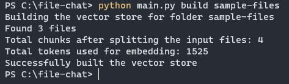
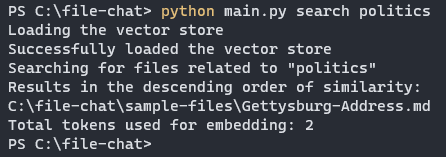
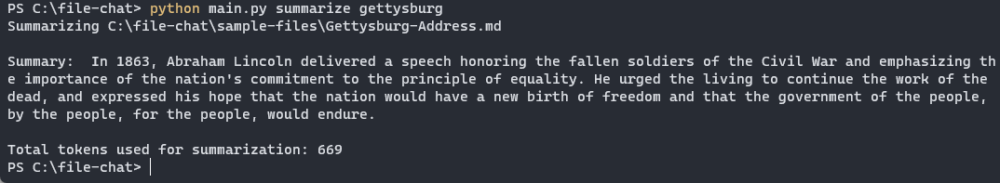
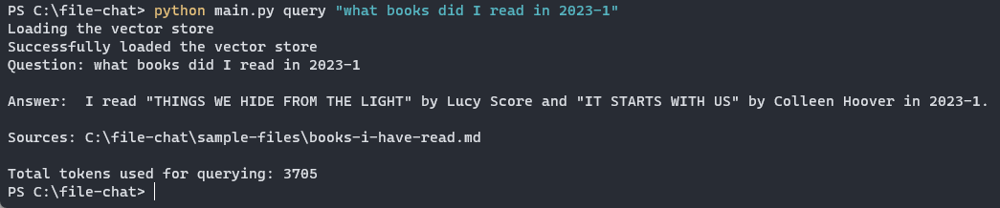
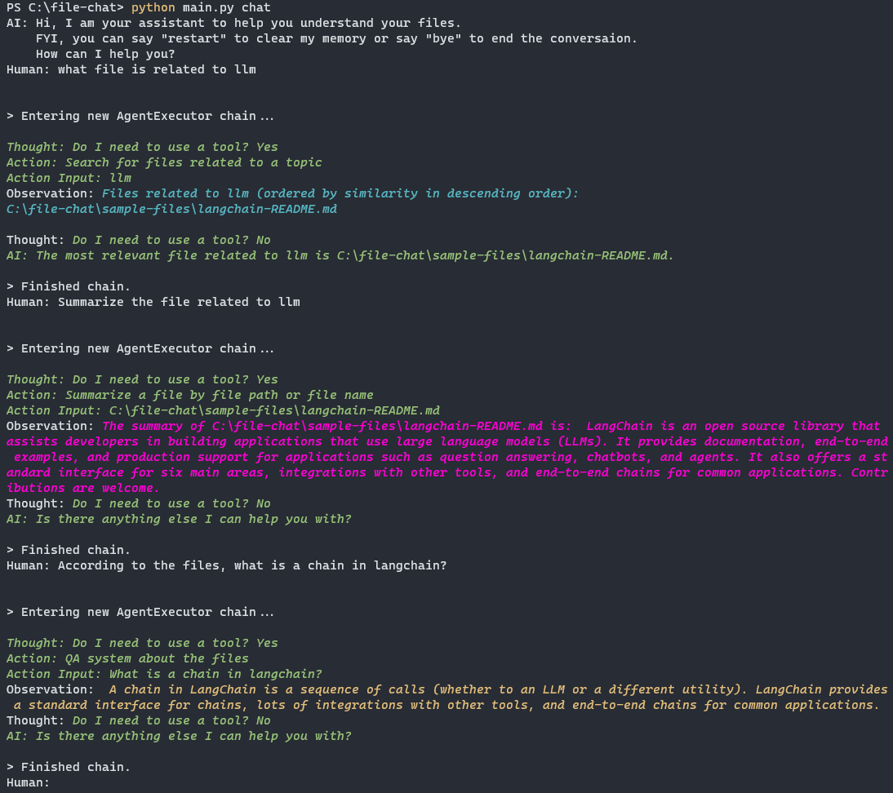

# File Chat

A user-friendly wraper of LLM to help you find, understand, and query your files.

## Get Started
### Setup Environment

In order to set your environment up to run the code on your local machine, first install all requirements:

```shell
pip install -r requirements.txt
```

Then, save your OpenAI API key to the environment variable named `OPENAI_API_KEY`.

If you don't have one, get one [here](https://beta.openai.com/playground).

For Bash:

```shell
export OPENAI_API_KEY=...
```

For PowerShell:

```powershell
$env:OPENAI_API_KEY="..."
```

### Preprocess Files
- Preprocess the files that you want AI to ingest.
  - Run `python main.py build {folder_path}`.
  - This will ingest all the `.md` files under the given folder.
  - The result of the preprocessing will be saved to the folder named `cache`.
  - All the subsequent commands *depend on* the preprocessing result.

- You can have a trial run with the sample files under the folder `sample-files` that come with this project.
  - Simply run `python main.py build sample-files`
  - The sample files are:
    - `books-i-have-read.md` is a fake note recording the list of books that somebody has read in 2023.
    - `Gettysburg-Address.md` is the famous Gettysburg Address by Abraham Lincoln.
    - `langchain-README.md` is the README file from [LangChain](https://github.com/hwchase17/langchain).



### Semantic Search
- Search for files related to a topic semantically.
- Command: `python main.py search {topic}`



### Summarization
- Summarize a file.
- Command: `python main.py summarize {file}`
  - `file` can be the file name or the absolute path to the file.
  - Note that `file` is fuzzily matched with the absolute paths, so you don't have to input the exact name or path.



### Natural Language Query
- Query facts in your files using natural language.
- Command: `python main.py query {question}`



### Chat
- Chat with an AI assistant that can access your files.
- Command: `python main.py chat`
- Available features:
  - Find related files
  - Summarize a file
  - Query facts in the files



## Credits
- This project is built with [LangChain](https://github.com/hwchase17/langchain), an awesome tool that abstracts the way we invoke LLMs.
- This project is inspired by [https://github.com/hwchase17/notion-qa](https://github.com/hwchase17/notion-qa).
